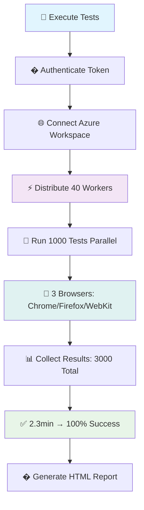

# Azure Playwright Workspaces Demo

🚀 **High-scale test automation demo** showcasing 1000+ parallel tests using Azure Playwright Workspaces.

## ✨ Demo Highlights

- **1000 parallel tests** across Chromium, Firefox, and WebKit
- **40-worker cloud execution** on Azure infrastructure  
- **2.3 minutes** total execution time
- **100% success rate** with access token authentication

## 🛠️ Quick Setup

### Prerequisites
```powershell
# Install Node.js (v18+)
winget install OpenJS.NodeJS

# Install Git
winget install Git.Git

# Verify installations
node --version && npm --version && git --version
```

### Installation
```powershell
# Clone and setup
git clone https://github.com/lenvolk/playwright-workspaces.git
cd playwright-workspaces\samples\playwright-tests
npm install

# Verify you're in the correct directory
pwd
# Should show: C:\Temp\GIT\playwright-workspaces\samples\playwright-tests
```

### Azure Configuration
1. **Create Workspace**: Go to [Azure Portal](https://portal.azure.com) → Search "Playwright Testing" → Create new workspace
2. **Generate Token**: Workspace → Settings → Access Management → Generate Access Token
3. **Configure Environment**: Create `.env` file:
```bash
PLAYWRIGHT_SERVICE_URL=wss://eastus.api.playwright.microsoft.com/playwrightworkspaces/YOUR_WORKSPACE_ID/browsers
PLAYWRIGHT_SERVICE_ACCESS_TOKEN=YOUR_JWT_TOKEN
PLAYWRIGHT_SERVICE_RUN_ID=
PLAYWRIGHT_SERVICE_OS=linux
```

## 🎮 Run Demo

**📁 Execute from directory**: `C:\Temp\GIT\playwright-workspaces\samples\playwright-tests`

```powershell
# Navigate to the correct demo directory
cd C:\Temp\GIT\playwright-workspaces\samples\playwright-tests

# Quick verification (3 tests)
npx playwright test --workers=1 --config=playwright.service.config.ts tests/example.spec.ts -g "test 0"

# Full demo (3000 tests)
npx playwright test --workers=40 --config=playwright.service.config.ts

# View results with custom port
npx playwright show-report --port=9324
```

## 📊 Architecture Flow



## 📁 Demo Structure

```
playwright-tests/
├── .env                          # 🔐 Azure credentials
├── .gitignore                    # 🚫 Excluded files
├── package.json                  # 📦 Dependencies
├── playwright.config.ts          # ⚙️ Base config
├── playwright.service.config.ts  # ☁️ Azure config
├── Readme.md                     # 📖 This guide
└── tests/
    └── example.spec.ts           # 🧪 Demo test suite (1000 tests)
```

## 🎯 Key Files

### `tests/example.spec.ts` - Main Test Suite
```typescript
// Generates 1000 tests dynamically
for (var i = 0; i < 1000; i++) {
  test('test ' + i, async ({ page }) => {
    await page.goto('https://playwright.dev/');
    await page.getByRole('link', { name: 'Get started' }).click();
    await expect(page).toHaveURL(/.*intro/);
  });
}
```

### `playwright.service.config.ts` - Azure Integration
- ✅ Access token authentication
- ✅ Auto-GUID generation for runs  
- ✅ Linux browser execution
- ✅ 30-minute timeout handling

## 🔧 Common Issues & Solutions

| Issue | Solution |
|-------|----------|
| 🔑 "Access token does not match" | Generate fresh token from Azure Portal |
| 🆔 "Invalid GUID format" | Leave `PLAYWRIGHT_SERVICE_RUN_ID` empty |
| 🌐 "Connection timeout" | Verify workspace URL format and region |
| 📦 "Package conflicts" | Run `npm install @azure/playwright@latest` |

## 📈 Performance Results

- **Test Scale**: 1000 unique tests
- **Browser Coverage**: 3x multiplier (Chromium, Firefox, WebKit)
- **Total Executions**: 3000 test runs
- **Parallel Workers**: 40 cloud instances
- **Execution Time**: 2.3 minutes
- **Success Rate**: 100%
- **Throughput**: ~22 tests/second

## 🚀 Next Steps

1. **Scale Testing**: Increase to 50+ workers for enterprise scenarios
2. **CI/CD Integration**: Add Azure DevOps or GitHub Actions
3. **Custom Tests**: Replace demo tests with your application tests
4. **Monitoring**: Integrate with Azure Monitor for performance tracking

## 📚 Resources

- [Azure Playwright Workspaces Docs](https://aka.ms/pww/docs)
- [Playwright Official Guide](https://playwright.dev/)
- [Azure Portal](https://portal.azure.com)

---
**Demo Status**: ✅ Ready to run | 🔧 Fully configured | � Production-ready
